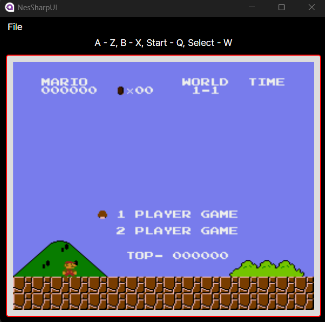
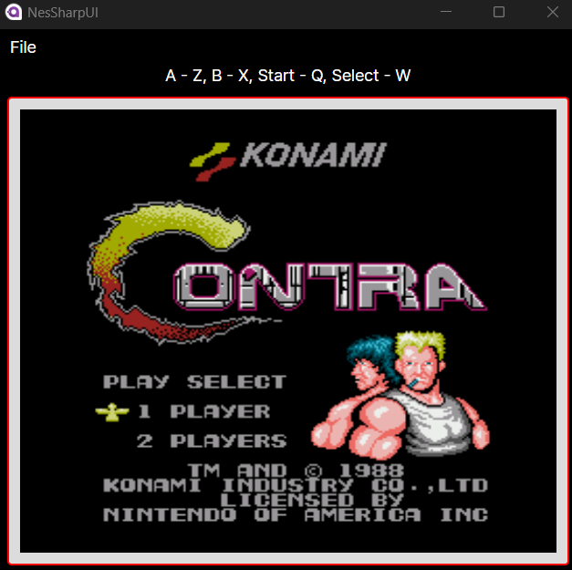

# NesSharp
A Nintendo Entertainment System (NES) emulator written in C#.

# Samples

")

# Controls

Controls cannot currently be configured.

- Arrow Keys = up,down,left,right
- Z = A
- X = B
- Q = Start
- W = Select

# NES CPU & PPU Doc
please refer to doc\NESDoc.pdf
